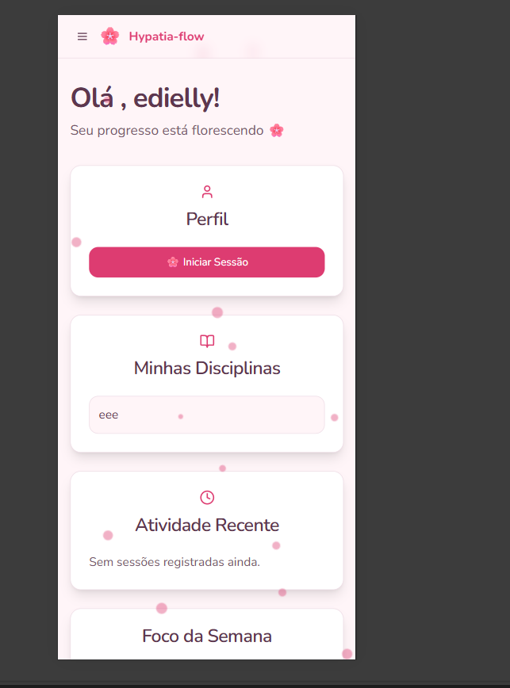

# Hypatia-Flow 

[](https://reactjs.org/)
[](https://nodejs.org/)
[](https://www.typescriptlang.org/)
[](https://www.prisma.io/)
[](https://hypatia-flow.vercel.app/)

**Hypatia-Flow** é uma aplicação web projetada para gamificar o processo de estudo, ajudando estudantes a se manterem motivados e organizados. Inspirado na tranquilidade das flores de cerejeira (sakura), o app transforma a disciplina em uma jornada visualmente recompensadora.

### [Acesse a demonstração ao vivo](https://hypatia-flow.vercel.app/)

---

## Funcionalidades Principais

- **Gamificação Intuitiva**: Ganhe XP e suba de nível a cada minuto de estudo. Veja seu progresso refletido visualmente.
- **Gerenciamento de Disciplinas**: Adicione, edite e organize facilmente todas as suas matérias de estudo.
- **Sessões de Estudo Detalhadas**: Registre cada sessão com data, hora, duração e observações importantes.
- **Dashboard de Progresso**: Tenha uma visão geral e instantânea de suas atividades recentes e desempenho.
- **Calendário Interativo**: Visualize sua frequência de estudos em um calendário, com detalhes de tempo e disciplinas estudadas por dia.
- **Autenticação Segura**: Sistema completo de login, registro e gerenciamento de perfil de usuário.
- **Design Responsivo**: Interface elegante e funcional em qualquer dispositivo, seja desktop ou mobile, construída com Tailwind CSS e Shadcn UI.

---

## Telas da Aplicação

| Dashboard | Disciplinas | Sessão de Estudo |
| :---: | :---: | :---: |
|  |  |  |

| Progresso | Calendário | Conquistas |
| :---: | :---: | :---: |
|  |  |  |

---

## Tecnologias Utilizadas

| Área       | Tecnologia                                                                                                 |
| :--------- | :--------------------------------------------------------------------------------------------------------- |
| **Frontend** | React, TypeScript, Vite, Tailwind CSS, Shadcn UI, Zustand, React Query, React Hook Form                      |
| **Backend**  | Node.js, Express.js, Prisma (ORM), JWT (Autenticação)                                                      |
| **Banco de Dados** | PostgreSQL (ou qualquer banco suportado pelo Prisma)                                                       |
| **Deploy**   | Vercel (Frontend & Backend)                                                                                |

---

## Começando

Siga estas instruções para configurar e executar o projeto em seu ambiente local.

### Pré-requisitos

- [Node.js](https://nodejs.org/) (versão 20.x ou superior)
- [npm](https://www.npmjs.com/) ou um gerenciador de pacotes compatível
- Um servidor de banco de dados (ex: PostgreSQL rodando localmente ou em um container Docker)

### Instalação e Configuração

1.  **Clone o repositório:**
    ```bash
    git clone https://github.com/EdiellyF/Hypatia-Flow.git
    cd Hypatia-Flow
    ```

2.  **Configure o Backend:**
    ```bash
    # Navegue até a pasta do backend
    cd backend/backend

    # Instale as dependências
    npm install

    # Crie o arquivo de ambiente a partir do exemplo
    cp .env-example .env
    ```
    - Abra o arquivo `.env` e preencha a `DATABASE_URL` com a string de conexão do seu banco de dados.

3.  **Aplique as migrações do banco de dados:**
    ```bash
    # Ainda na pasta backend/backend
    npx prisma migrate dev
    ```

4.  **Configure o Frontend:**
    ```bash
    # Volte para a raiz e vá para a pasta do frontend
    cd ../../front-end

    # Instale as dependências
    npm install
    ```

5.  **Inicie os servidores:**
    - **Terminal 1 (Backend):**
      ```bash
      cd backend/backend
      npm run dev
      ```
    - **Terminal 2 (Frontend):**
      ```bash
      cd front-end
      npm run dev
      ```

- O frontend estará disponível em `http://localhost:5173` (ou outra porta indicada).
- O backend estará rodando em `http://localhost:3001`.

---

## Contribuições

Contribuições são sempre bem-vindas! Sinta-se à vontade para abrir *issues* para relatar bugs ou sugerir novas funcionalidades, ou enviar *pull requests* com melhorias.

## Licença

Este projeto está licenciado sob a **Licença MIT**. Veja o arquivo `LICENSE` para mais detalhes.
